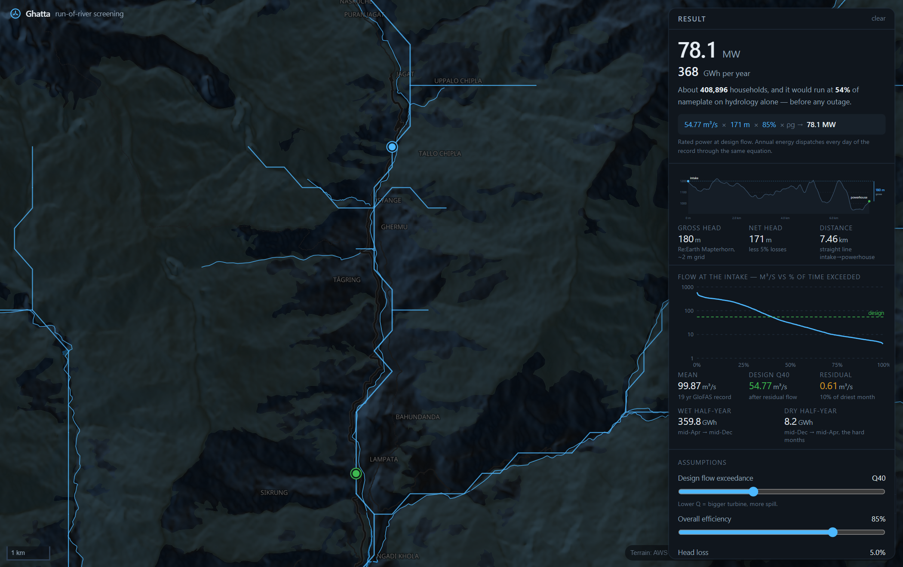

# Ghatta — run-of-river screening

   

**Click a river. Click downstream. Get the power.**

Place an intake and a powerhouse on any river in the world and Ghatta reads the flow from a
20-year reanalysis and the head straight off terrain tiles, then shows you capacity, annual
energy, and exactly where every number came from.

No backend, no account, no API key. Every request goes from your browser to a public API, so it
deploys free to any static host and works the same running locally.



## How it works

1. **Click a river** → the intake. Flow at that point comes from the GloFAS v4 reanalysis
   (20 years of daily discharge, m³/s, global).
2. **Click downstream** → the powerhouse. Head comes from Terrarium DEM tiles sampled along the
   line between the two, bilinearly interpolated.
3. **Read the answer.** `ρ · g · Q · H · η` is printed as a visible chain, not hidden. Annual
   energy dispatches every day of the 20-year record through the same equation, honouring
   residual flow, turbine capacity and the minimum-flow shutdown.
4. **Drag either marker** to tune it. Everything recomputes.

The URL holds the whole session, so a link reproduces the exact reading.

## What it refuses to hide

- **Two models, one river.** Where a mapped river network is available it reports its independent
  long-term mean beside GloFAS's. If they disagree by more than 2×, the app says so loudly — the
  ~5 km model grid can sit on a different channel entirely, and that is a 5× error in your answer,
  not a rounding difference.
- **Every figure states its source** underneath it — which DEM, what grid spacing, how many years
  of record, how far the model cell is from your click, whether the flow came from the network or
  a cache.
- **Modelled is not measured.** GloFAS is a model. It is labelled as one.
- **DEM error is real.** Global terrain carries roughly ±10–16 m of vertical error in steep
  ground, which is stated next to the head it produced.

## Assumptions you control

Design flow exceedance (Q15–Q85), overall efficiency, head loss, residual flow as a share of the
driest month, and the household figure used for the plain-language comparison. All live.

## Quickstart

```bash
npm install
npm run dev      # http://localhost:5173
npm run check    # 36 assert-based physics checks
npm run build    # typecheck + production build
```

## Data sources

| Source | Access | Licence | Powers |
|---|---|---|---|
| GloFAS v4 via Open-Meteo | runtime, keyless, CORS ✓ | CC-BY 4.0 | Daily discharge, 20 years, worldwide |
| Re:Earth Terrain (Mapterhorn / Copernicus GLO-30) | runtime, keyless, CORS ✓ | CC-BY 4.0 | Elevation profile and head |
| AWS Terrain Tiles | runtime, keyless, CORS ✓ | public domain / attribution | Hillshade, and DEM fallback |
| OpenFreeMap / OpenMapTiles / OSM | runtime, keyless | ODbL | Basemap |
| HydroRIVERS v1.0 extract | bundled, 525 KB gz | HydroSHEDS licence | Catchment area, click snapping, the cross-check |

Every runtime endpoint had its `access-control-allow-origin` verified with a real request — see
[docs/research/](docs/research/).

## What this is not

Screening, not a feasibility study. It is enough to rank ideas and decide what to survey next; it
is not a basis for investment, licensing or design. The profile is a straight line between two
points, not a routed waterway. Costs are not modelled at all.

## Built on other people's work

| Project | Licence | How it is used |
|---|---|---|
| [HydroGenerate](https://github.com/IdahoLabResearch/HydroGenerate) — Idaho National Laboratory | BSD-3-Clause | Turbine selection regions and part-load efficiency curves (CANMET/RETScreen 2004 correlations) **ported to TypeScript** in `src/engine/turbine.ts`. Two formulas are deliberately corrected to their published forms; both deviations are documented in the source with the reason. |
| [GRASS GIS `r.green.hydro`](https://github.com/OSGeo/grass-addons) | GPL-2.0+ | Scheme search *method* only — a grid search over intake position × plant length. GPL code is not copied into this MIT project; the published algorithm is reimplemented, with residual flow and a real flow-duration curve added. |
| [OpenHPL](https://github.com/OpenSimHub/OpenHPL) | MPL-2.0 | Equation reference for hydraulic losses (consulted; the 1D module is not yet built). |

BSD-3-Clause notice for HydroGenerate: Copyright (c) Battelle Energy Alliance, LLC / Idaho
National Laboratory. Redistribution and use in source and binary forms, with or without
modification, are permitted provided that the conditions of the BSD-3-Clause licence are met.

Not usable in a browser-only app, despite being excellent: HydroMT, pysheds (Python),
OpenDroneMap (Python/C++), OpenFOAM (C++). These need a backend or a WASM runtime — see
[plan.md](plan.md).

## Licence

[MIT](LICENSE). Bundled data keeps its upstream licence.
