# RiverPower

**Run-of-river hydropower prefeasibility screening, entirely in the browser.**

[](LICENSE)
[](tsconfig.json)
[](#how-it-works)
[](#data-sources)
[](src/hydro.check.ts)

Pick a point on a river and get a flow-duration curve, an energy estimate with every
intermediate value shown, terrain-measured head, and the existing dams nearby — from public
data, with no server, no account and no API key anywhere in the stack.

Every request goes straight from the visitor's browser to a public API. River discovery in Nepal
uses the bundled HydroRIVERS network, so browsing and ranking candidate reaches does not consume
an API allowance at all.

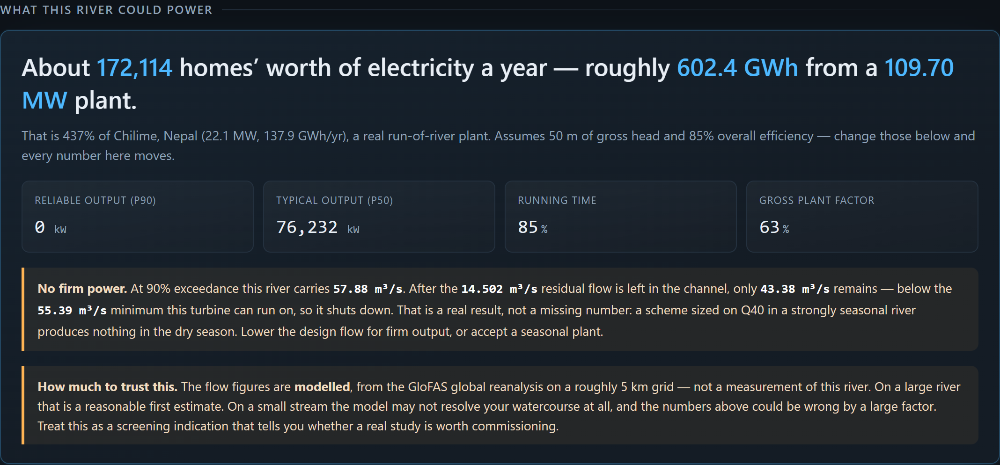

---

## What it does

- **Site finder** — rank mapped Nepal river reaches by HydroRIVERS mean discharge, entirely
  locally. Filter by minimum flow, then analyse a centerline point in one click.
- **Flow-duration curve** from the latest 20 complete years of GloFAS v4 daily discharge at any
  point on Earth, built client-side and cached by the model's 0.05° grid cell.
- **Energy estimate** — `P = ρ·g·Q·H·η` evaluated across the whole curve, giving P50, P90,
  Q40-design power and annual GWh/yr, with the formula and every intermediate value on screen.
- **Live discharge** from the nearest gauging station, with distance, reading age, and whether
  the value is provisional or approved.
- **Terrain-measured gross head** — decoded from DEM tiles in the browser, so head is measured
  between two points rather than assumed.
- **Catchment context** — 20-year rainfall climatology, monthly flow seasonality, and the
  wet/dry ratio that decides whether a scheme has firm output.
- **What already exists nearby** — dams, weirs, reservoirs and hydro plants from OpenStreetMap,
  with installed capacity where it is mapped.
- **CSV export** with a metadata header (source, period of record, units, every assumption) so
  the curve and energy table are usable in a real study.
- **Provenance on every figure** — `measured`, `calculated`, or `estimate`.

### Finding a site

Scan the Nepal view, filter by flow, and click through to the full assessment. Every candidate is
placed directly on a HydroRIVERS centerline, sized by discharge, so trunk rivers read at a glance
without making a flood-service request for each search point.

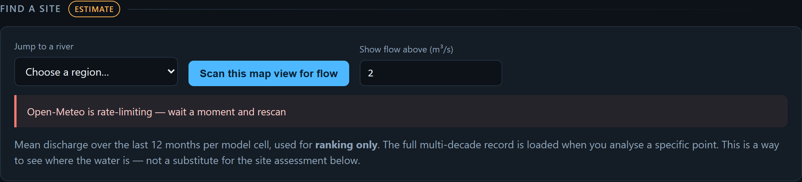

### Flow-duration curve

Log discharge axis, because a linear one hides the low-flow tail that P90 depends on. The shaded
band above the design flow is water that gets spilled, not generated.

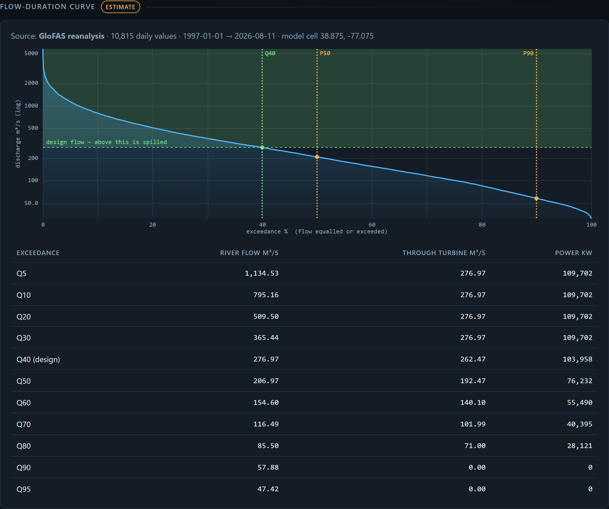

### The arithmetic, in the open

No hidden constants. Change any assumption and every number moves.

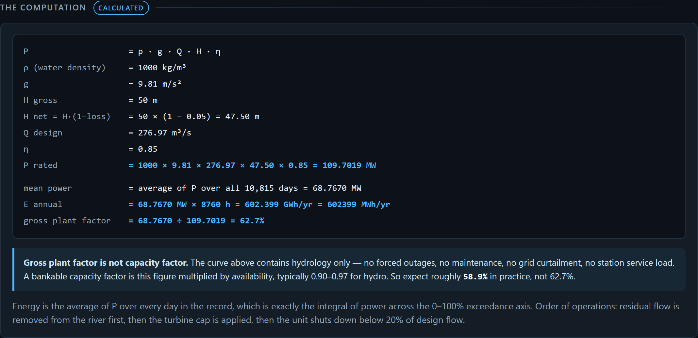

### Measured cross-check

Where a gauge exists, it is shown next to the modelled headline — including the awkward cases:
records that stopped in 1933, and stations that report stage but not discharge.

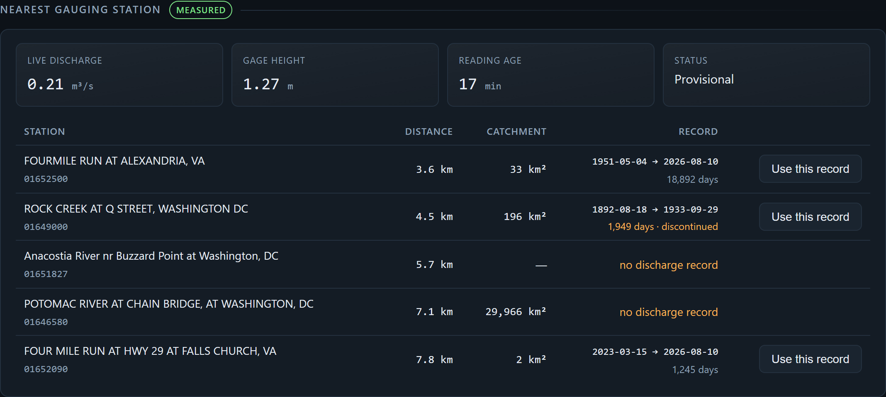

### Terrain

Gross head is measured from DEM tiles decoded in the browser. Zoom is chosen per reach against a
tile budget, so a short penstock is sampled at sub-metre spacing rather than a fixed ~17 m.

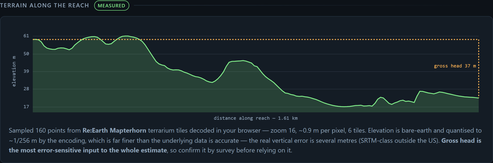

### Nepal

Nepal gets extra depth, because it is where the global data is weakest and the stakes are highest.

**Is this river already taken?** 572 licensed hydropower projects from the Department of
Electricity Development registry, with coordinates, capacity, promoter and licence stage. Fetched
live (128 KB, `ACAO: *`). Clicking the Trishuli surfaces Devighat and Trishuli HPP operating 2–3 km
away and ~598 MW licensed within 25 km — the fastest way to learn a reach is spoken for.

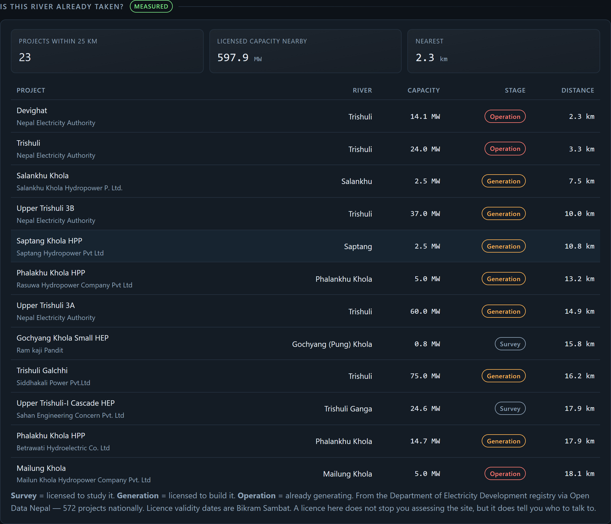

**Upstream catchment area and long-term mean flow per reach**, from a HydroRIVERS v1.0 extract
built for Nepal — 42,197 reaches, 525 KB gzipped, loaded only for Nepali points. This is the one
thing no keyless global API provides, and it gives the app a second, independent opinion on flow
to cross-check GloFAS against.

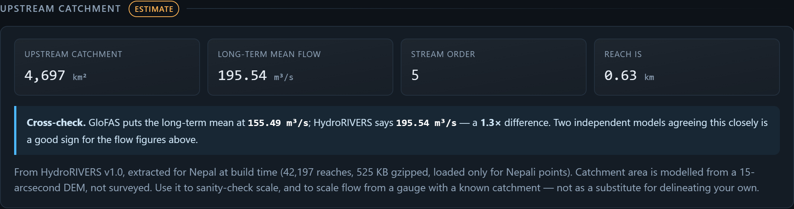

Validated against published catchment areas at long-established DHM gauging stations:

| Station | Published | HydroRIVERS | Error |
| --- | --- | --- | --- |
| Trishuli at Betrawati | 4,600 km² | 4,500 km² | −2.2% |
| Narayani at Devghat | 31,100 km² | 31,655 km² | +1.8% |
| Sapta Koshi at Chatara | 54,100 km² | 54,412 km² | +0.6% |
| Bagmati at Khokana | 585 km² | 611 km² | +4.4% |
| Karnali at Chisapani | 42,890 km² | 45,721 km² | +6.6% |

Chatara needed a fix to get there. The geometrically nearest reach was a 12 km² tributary 260 m
away, which would have understated the catchment by a factor of 4,500. The lookup now reports the
dominant channel within 1.5 km as a separate option with its exact mapped point. It never silently
moves the intake: the user must choose **Use the larger channel**.

**Indicative revenue** at standard NEA run-of-river PPA rates, split across the seasons the tariff
actually uses — NPR 4.80/kWh wet (mid-April to mid-December) and NPR 8.40/kWh dry.

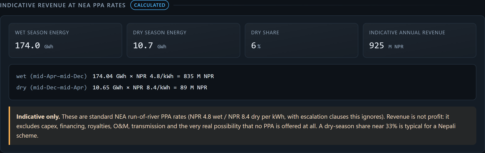

**Real gauges, honestly framed.** Nepal has 1,115 DHM hydromet stations and none of their readings
are open — `/gss/api/observation` returns `403 Api Keys required`. Saying "no gauge here" would be
false, so the app names the real stations nearby, draws them on the map, and tells you where to go
and ask for the record.

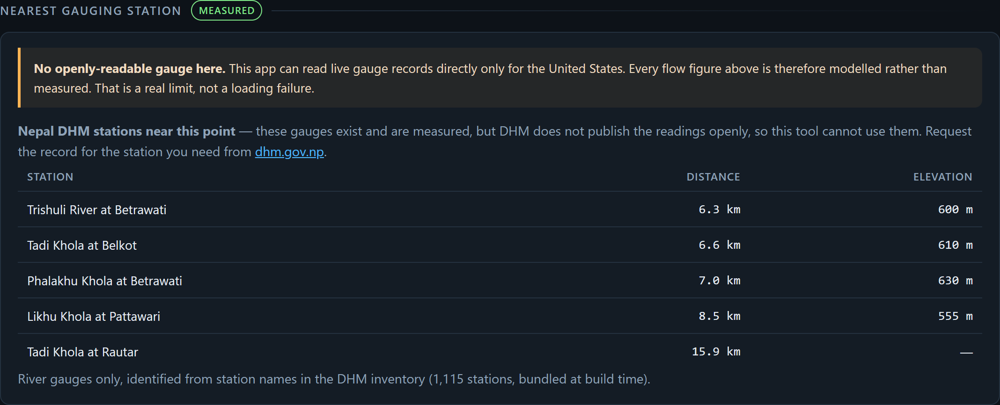

**Earthquake history**, because Nepal is highly seismic and this used to sit under "cannot see".
The USGS FDSN catalog returns 148 events of M4.5+ within 100 km of the Trishuli since 1900,
including the 2015 Gorkha M7.8 at 54 km. It is a record of what happened, not a hazard model.

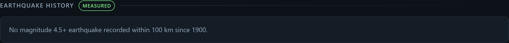

Four Nepal-specific corrections worth calling out, because each changed a number materially:

| Correction | Effect |
| --- | --- |
| Household consumption **912 kWh/yr**, not a generic 3,500 (NEA FY2024/25: 4,743 GWh domestic sales ÷ 5.20 M domestic connections) | "Homes powered" was understated **3.8×** |
| Residual flow defaults to **10% of the lowest monthly mean**, the basis Nepal licensing uses, not 10% of the annual mean | On a 32×-seasonal river this moved annual energy from 159 GWh to **185 GWh** |
| Precipitation switched from **ERA5 to NASA POWER** after measuring both against known station totals | Trishuli valley went from 2,911 mm/yr to **1,311 mm/yr** |
| DEM sampling picks the finest tiles available — **z17 at ~0.5 m/px** where the old fixed zoom gave ~17 m/px | Gross head, the most error-sensitive input, is far better sampled |

The residual-flow one matters most: 10% of *mean annual* flow is a temperate convention, and on a
monsoon river the mean is dominated by flood season — it can exceed the entire dry-season flow and
wrongly zero out firm power.

The rainfall one is a caution as much as a fix. Measured 20-year means against three Nepali
stations with well-known totals:

| Station | Actual | ERA5 | NASA POWER |
| --- | --- | --- | --- |
| Kathmandu | 1,400–1,600 mm | 2,848 | **1,224** |
| Jomsom (rain shadow) | 250–340 mm | 2,593 | 951 |
| Lumle (wettest in Nepal) | ~5,000 mm | 2,699 | 1,316 |

NASA POWER is much better in the mid-hills, where most schemes sit. But **neither resolves
Himalayan orography**: the real Lumle:Jomsom contrast is about 16×, ERA5 renders it as 1.04× and
NASA POWER as 1.38×. The app says so next to the chart.

---

## Quickstart

```bash
npm install
```

```bash
npm run dev
```

Then open http://localhost:5173 and click a point on a river.

| Script | What it does |
| --- | --- |
| `npm run dev` | Vite dev server |
| `npm run build` | Typecheck + production build to `dist/` |
| `npm run typecheck` | TypeScript strict, no emit |
| `npm run check` | 36 assert-based checks on the energy and FDC math |
| `npm run shots` | Regenerate the README screenshots from the running app |
| `npm run perf` | Measure the network cost of a zoom/pan sweep |
| `npm run build:dhm` | Rebuild the bundled Nepal DHM station inventory (see below) |
| `npm run build:rivers` | Rebuild the Nepal river network from HydroRIVERS (90 MB one-time download) |

---

## How it works

There is no server. `src/api.ts` calls public APIs directly from the browser; every endpoint in
it was verified to send `access-control-allow-origin` with a real request, not by trusting docs.

```
src/hydro.ts        pure math — FDC, P = ρgQHη, energy integration. No I/O.
src/hydro.check.ts  assert-based checks for the above
src/api.ts          every network call, one function per source
src/charts.ts       hand-drawn canvas charts, no chart library
src/App.tsx         the single scrolling page
```

Annual energy is computed by averaging power over every day in the record, which is exactly the
integral of power across the 0–100% exceedance axis. `hydro.check.ts` also computes it the
textbook way — trapezoidal integration over the flow-duration curve — and asserts the two agree.

### Map performance

"The map feels slow" needed a number, so `npm run perf` measures a zoom/pan sweep. It found DEM
tiles were **84% of all bytes** — 4.4 MB per sweep — because every zoom level fetched a fresh set.

| | Requests | Bytes |
| --- | --- | --- |
| Before | 91 | 5,294 KB |
| After | 44 | **1,954 KB** |

Capping the `raster-dem` source at zoom 12 and stopping hillshade at site scale does most of the
work: overzoomed relief is blurry anyway, so the vector map looks *better* there as well as costing
less. `refreshExpiredTiles: false` stops MapLibre re-requesting AWS terrain tiles that ship no
`Cache-Control`, and a deeper tile cache makes zooming back out free.

The Nepal river network is a 1.4 MB binary but decodes and spatially indexes in **7 ms** — typed
arrays and delta-encoded integers, so there is no main-thread stall.

Flood-service traffic is deliberately sparse. Candidate discovery is local, GloFAS is requested
only for the selected 0.05° model cell, duplicate in-flight requests are coalesced, successful
records are retained in browser storage for 180 days, and `Retry-After` cooldowns are honoured.
The rainfall payload uses NASA POWER's monthly endpoint rather than downloading 7,300 daily
values. The production bundle also separates the MapLibre and React runtimes into stable cacheable
chunks.

### Validation

The physics is checked against a real published plant: **Chilime, Nepal** (22.1 MW, 337.46 m net
head, 7.5 m³/s design flow, 137.9 GWh/yr).

```
ρgQH at η=1  = 24.83 MW
implied η    = 22.1 / 24.83 = 0.890   ← Pelton + generator + transformer
implied PF   = 137.9 / (22.1 × 8.76) = 71.2%   ← run-of-river with peaking pondage
```

Both land where they should. `npm run check` asserts this, the worked example
(`Q=10, H=50, η=0.85 → 4,169,250 W`), the unit conversions, and the turbine constraints.

### Units, the most likely way this goes wrong

| Trap | Handling |
| --- | --- |
| USGS reports **ft³/s** | converted with `0.0283168466` (= 0.3048³) |
| USGS `-999999` no-data sentinel | filtered before sorting — otherwise it becomes the P90 flow |
| USGS values arrive as **strings** | `Number()` coerced, non-finite dropped |
| GloFAS reports **m³/s** | used as-is; never mixed with ft³/s |
| kW / MW / GWh | `GWh/yr = MW × 8.76 × CF`; 8760 h frozen, no leap-year switching |
| capacity factor vs plant factor | an FDC yields a **gross** factor; real CF = that × availability (0.90–0.97) |

---

## Data sources

All keyless, all CORS-verified from a browser origin.

| Source | Used for | Licence |
| --- | --- | --- |
| [Open-Meteo Flood API](https://open-meteo.com/en/docs/flood-api) (GloFAS v4) | Latest 20 complete years of daily river discharge, global, m³/s | CC-BY 4.0 |
| [NASA POWER](https://power.larc.nasa.gov/) (MERRA-2) | 20-year precipitation climatology | NASA open data |
| [USGS FDSN event catalog](https://earthquake.usgs.gov/fdsnws/event/1/) | Historical earthquakes near a site | Public domain |
| [USGS Water Services](https://waterservices.usgs.gov/) | Live + historical US discharge, station metadata, drainage area, period of record | Public domain |
| [OpenStreetMap](https://www.openstreetmap.org/copyright) via [Overpass](https://overpass-api.de/) | Dams, weirs, reservoirs, hydro plants | ODbL |
| [OpenFreeMap](https://openfreemap.org/) | Vector basemap (rivers included in the tiles) | ODbL |
| [Re:Earth Terrain](https://terrain.reearth.land/) (Mapterhorn) | Primary DEM — 512 px terrarium tiles to z17 | See source |
| [AWS Terrain Tiles](https://registry.opendata.aws/terrain-tiles/) | Fallback DEM — 256 px terrarium tiles to z15 | Various, see registry |
| [Nepal DHM](https://hydrology.gov.np/) | Station inventory only, bundled at build time | Nepal Govt. open data |
| [HydroRIVERS v1.0](https://www.hydrosheds.org/products/hydrorivers) | Upstream catchment area + mean discharge per reach (Nepal extract, build time) | CC BY 4.0 |
| [Open Data Nepal](https://opendatanepal.com/) | 572 licensed hydropower projects (DoED registry) | Open data |
| Nepal Electricity Authority Annual Report FY2024/25 | Household consumption, national hydro totals, PPA rates | Published report |

**The one thing not fetched live:** `src/dhm-stations.json`. The DHM station API sends
`access-control-allow-origin: *` but returns **45 MB uncompressed in ~50 s** and ignores every
pagination parameter, so it is trimmed to 1,115 stations / 19 KB gzipped by `npm run build:dhm`.
Readings are not included because DHM does not publish them.

Sources that look ideal and **cannot** be used from a browser — OpenTopoData, GRDC, GSIM,
Copernicus CDS, ORNL HydroSource, the official USACE NID API — are documented with evidence in
[`PHASE1-REPORT.md`](PHASE1-REPORT.md), along with the raw probe output in
`phase1-raw-probes.json`.

---

## Deploying to Vercel

It is a static site, so there is nothing to configure and no environment variables to set.

```bash
npx vercel --prod
```

Or import the repo in the Vercel dashboard. Vercel detects Vite automatically; if you prefer to
be explicit:

- **Framework preset:** Vite
- **Build command:** `npm run build`
- **Output directory:** `dist`
- **Install command:** `npm install`
- **Environment variables:** none. If you find yourself adding one, something has gone wrong.

The same `dist/` works on Netlify, GitHub Pages, Cloudflare Pages or any static host. Because
every API call is made by the visitor's browser, a deployed copy is exactly as live as a local
one — there is nothing to keep warm and nothing to pay for.

---

## What this is **not**

This is **prefeasibility screening**. Its purpose is to tell you whether a site is worth
investigating properly. It is **not** a feasibility study, and it is not evidence for an
investment decision, a permit application or a grid connection request.

It cannot see:

geology and foundations · sediment load · land ownership and consents · grid connection distance
and cost · legally required environmental flows · fish passage and ecological impact · seasonal
ice and ice-affected gauge readings · water rights and existing abstractions · access roads and
construction logistics · flood risk and spillway design · capital cost, tariff and financing ·
sub-daily flow variability (it uses daily means)

Two limits worth stating plainly:

- **Outside the United States, the flow figures are modelled, not measured.** GloFAS runs on a
  ~5 km grid. On a large river it is a reasonable first estimate. On a small stream it may not
  resolve your watercourse at all. The app warns when a neighbouring grid cell carries very
  different flow, because landing one cell off the channel can change the answer by 100×.
- **Gross head is the most error-sensitive input.** The app samples the finest DEM tiles it can
  reach — sub-metre spacing on a short reach — but *sampling resolution is not vertical accuracy*.
  The underlying data is SRTM-class outside the US, so real vertical error remains several metres.
  Confirm head by survey before relying on it.
- **In Nepal there is no open measured discharge at all.** The flow figures are GloFAS, and the
  DHM stations the app lists are there so you can go and obtain the real record — not because it
  has one.

---

## Contributing

Issues and pull requests welcome. If you add a data source, verify its CORS headers with a real
request and record the evidence — the pattern used throughout `PHASE1-REPORT.md` is:

```bash
curl -s -D - -o /dev/null -H "Origin: https://foo.dev" "<url>"
```

Use a real `GET`, not `HEAD` — several hydrology services reject `HEAD` and will give you a false
negative.

## Licence

[MIT](LICENSE). Data from the sources above remains under its own licence.
