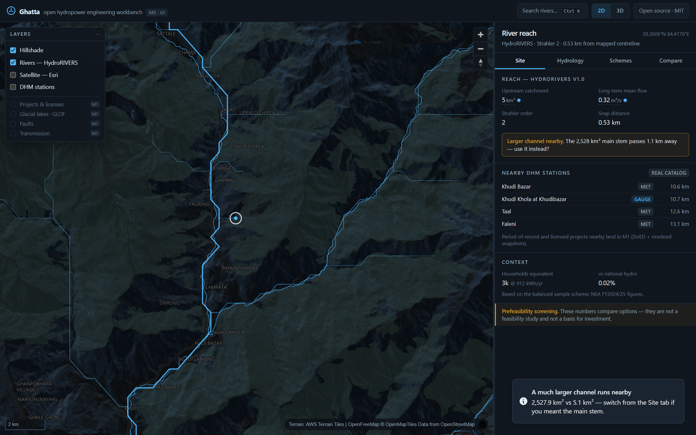
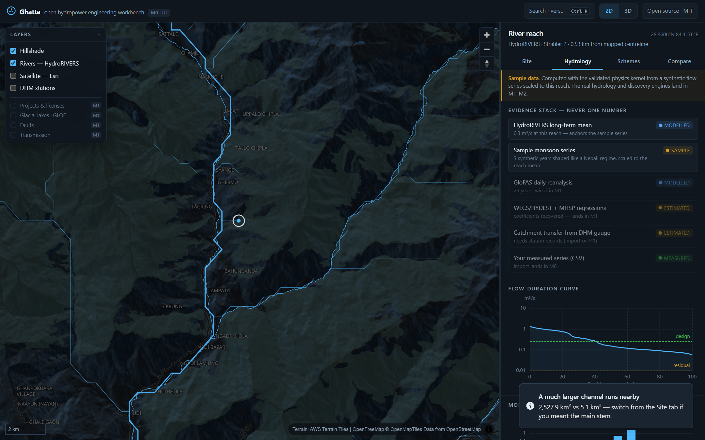
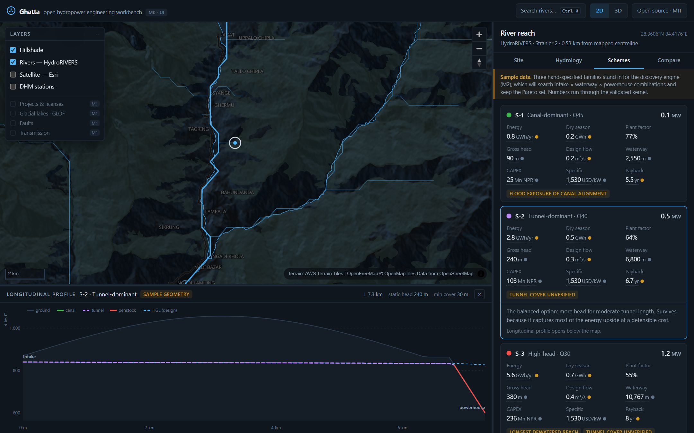
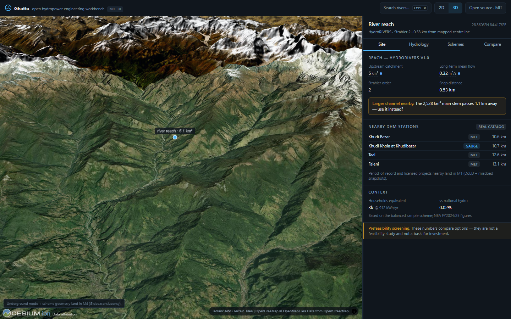

# Ghatta — open hydropower engineering workbench

   

A **Nepal-first, browser-only workbench for early hydropower project development**: click a river,
understand the site, draft complete scheme alternatives (intake → waterway → penstock →
powerhouse), compare them honestly, and trace every number back to its evidence. No backend, no
API keys — every byte comes from open data, so it deploys free and stays exactly as live as a
local copy.

> **घट्ट (ghatta)** — the traditional Nepali water mill.

**Stage: M0 (workbench UI).** The full product plan, research evidence and milestones live in
[plan.md](plan.md) and [docs/research/](docs/research/). Scheme numbers currently run through the
validated physics kernel on **sample-labelled** synthetic flow series; the discovery and hydrology
engines land in M1–M3.

| | |
|---|---|
|  |  |
|  |  |

## What works today

- **2D planning map** — MapLibre + OpenFreeMap dark carto, discharge-scaled **HydroRIVERS**
  network (42,197 Nepal reaches, bundled, validated ±7% vs published catchments), hillshade,
  satellite toggle, **1,115 real DHM stations**.
- **Click a river** → reach card with upstream catchment and long-term mean flow, honest snap
  distance, and a *"larger channel nearby"* guard (caught a 4,500× catchment understatement in
  testing).
- **3D scene** — CesiumJS on a keyless global quantized-mesh terrain (Re:Earth / Mapterhorn,
  CC-BY), lazy-loaded only when you enter 3D. Underground mode lands in M4.
- **Hydrology evidence stack** — never one number: each source carries a
  `measured / modelled / estimated / assumed / sample` chip; FDC and monthly regime with NEA PPA
  seasons and the Nepali residual-flow basis (10% of minimum monthly mean).
- **Scheme cards, compare table, energy-vs-cost scatter** and a bespoke **longitudinal profile**
  (ground, canal/tunnel/penstock invert, HGL, tunnel cover, low-cover warnings, hover readout).
- **Provenance on click** — every traced value opens its method, source and quality.
- **Ctrl-K palette**, resizable panels, phone layout, reduced-motion respected.

## Quickstart

```bash
npm install
npm run dev        # workbench at http://localhost:5173
npm run check      # 36 assert-based physics checks
npm run build      # typecheck + production build (dist/)
```

Deploys as a static site (Vercel/Netlify/Pages). No environment variables.

## Data sources (in this build)

| Source | Access | License | Powers |
|---|---|---|---|
| HydroRIVERS v1.0 (Nepal extract, `pipeline/build-hydrorivers.mjs`) | bundled 525 KB gz | HydroSHEDS license (attribution) | River network, catchment area, mean flow |
| DHM station catalog (`pipeline/build-dhm-stations.mjs`) | bundled | Government of Nepal, public | Station context |
| OpenFreeMap / OpenMapTiles / OSM | runtime, keyless | ODbL | Basemap |
| AWS Terrain Tiles (Terrarium) | runtime, keyless, CORS ✓ | Mapzen/USGS et al. | Hillshade |
| Re:Earth Terrain · Mapterhorn (Copernicus GLO-30) | runtime, keyless, CORS ✓ | CC-BY 4.0 | 3D quantized-mesh terrain |
| Esri World Imagery | runtime, keyless | Esri terms (attribution) | Satellite layer |
| NEA FY2024/25 published figures | constants | public report | Households equivalent, PPA seasons |

The full source hunt — with real CORS probes, licenses and dead ends — is in
[docs/research/2026-08-12-data-hunt.md](docs/research/2026-08-12-data-hunt.md).

## What this is not

A prefeasibility **screening** companion, not a feasibility study. Nothing here is a basis for
investment, licensing or design; the UI says so next to the numbers, not in a footer. DEM-derived
heads carry ±10–16 m vertical error in steep terrain; modelled flows are labelled modelled; sample
data is labelled sample.

## License

[MIT](LICENSE). Data files keep their upstream licenses (tracked per-asset; see plan.md §4).
